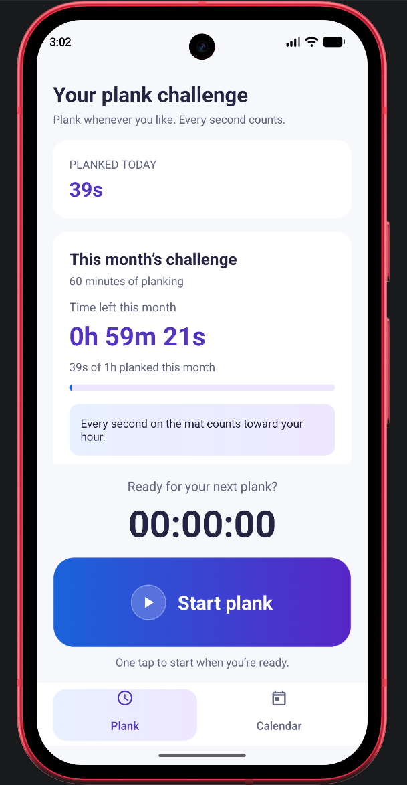
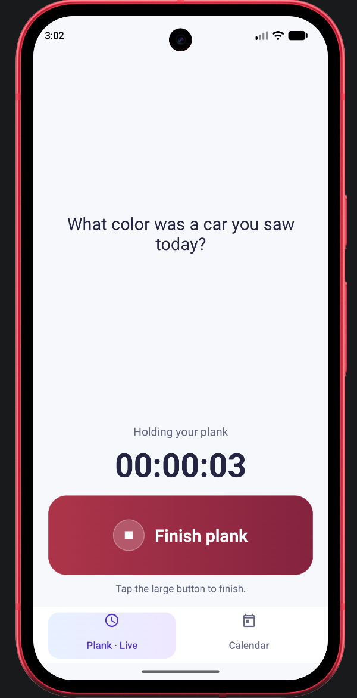
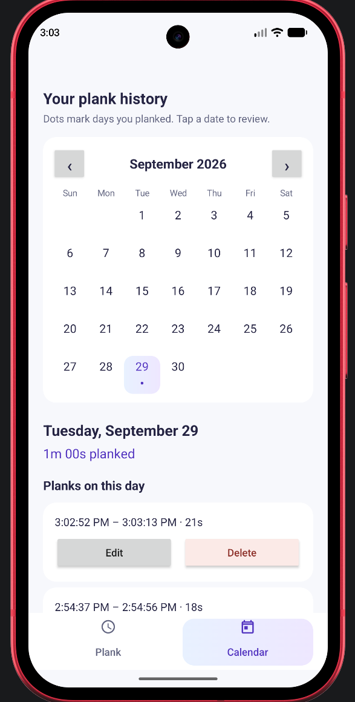

# plankr

plankr is a n Android fitness app with a simple challenge: hold a plank for a total of **60 minutes each month**. Short sessions count too, and there is no schedule to follow.

  
## Features

- **Plank timer:** Start and finish a plank with one large button. An active session keeps accruing time while the app is closed; its start timestamp is saved and elapsed time is calculated when you return.
- **Plank anytime:** Start the timer whenever you train. Only sessions actually recorded in the app count toward the challenge—no manual entries.
- **Monthly challenge:** Track progress toward 60 minutes each calendar month. Remaining time updates to the second; the total starts fresh on the first day of each month without deleting past planks.
- **Monthly progress:** The challenge card shows time remaining, progress toward the goal, and any extra time beyond it.
- **Calendar:** Dots mark days with planks. Select a date to see its total and sessions; completed planks can be edited or deleted.

Planks crossing midnight or a month boundary contribute only their overlapping time to each day or month. Entries are saved on the device using Android `SharedPreferences` (and may be included in Android backup, depending on device settings).

## Build and test

Open the project in Android Studio with the Android SDK installed. The app supports Android 7.0 (API 24) and newer. You can also use the included Gradle wrapper:

```sh
./gradlew assembleDebug
./gradlew testDebugUnitTest
```

The debug APK is written to `app/build/outputs/apk/debug/app-debug.apk`. A debug APK is intended for development, **not** for publishing as a release.

## Version updates and GitHub releases

Releases are currently made manually; this repository has no automated signing or GitHub Actions release workflow.

1. **Bump the version.** In `app/build.gradle.kts`, increase `versionCode` for every new APK and set a matching, human-readable `versionName`. For example, after releasing `1.0` with code `1`:

   ```kotlin
   versionCode = 2
   versionName = "1.1"
   ```

   Keep `applicationId` unchanged so the new APK can update existing installs. `versionCode` must be higher than the installed version's code.

2. **Build and test.** Run `./gradlew testDebugUnitTest assembleDebug`, then in Android Studio choose **Build → Generate Signed App Bundle / APK → APK** and select the **release** variant. For the first release, choose **Create new** to make a `.jks` keystore. For every later release, choose **the same existing keystore and key alias**. Back up the keystore and passwords securely outside the repository; losing the key prevents users from installing future updates over their existing app.

3. **Verify the signed APK.** Use the output path shown by Android Studio (often `app/release/app-release.apk`). Confirm the APK was rebuilt after the version change. Install it over a previous release on a device to check that it upgrades successfully and retains recorded planks. Do not use a debug APK or an unsigned release APK.

4. **Publish on GitHub.** Commit and push the source changes. On the repository's **Releases** page, select **Draft a new release**, create a new tag matching `versionName` (for example, `v1.1`) on that commit, upload the signed APK, add release notes, and publish. Attach the APK as a **release asset** rather than committing it to Git.

   If you use GitHub CLI instead, run this after pushing the version change, replacing the path with your signed APK's actual location:

   ```sh
   gh release create v1.1 "app/release/app-release.apk#plankr-v1.1.apk" --title "plankr 1.1" --generate-notes
   ```

Never upload the keystore or passwords to GitHub. Running `./gradlew assembleRelease` without a release signing configuration is **not** a substitute for generating a signed APK.

## Code layout

| Path | Responsibility |
| --- | --- |
| `app/src/main/java/at/oderwieoderw/plankr/ui/` | Activity navigation and display formatting |
| `app/src/main/java/at/oderwieoderw/plankr/ui/tracking/` | Plank timer and monthly challenge |
| `app/src/main/java/at/oderwieoderw/plankr/ui/calendar/` | Calendar, day history, and session editing |
| `app/src/main/java/at/oderwieoderw/plankr/domain/` | Day/month calculations and goal-progress stages |
| `app/src/main/java/at/oderwieoderw/plankr/data/local/` | Local plank-session storage |
